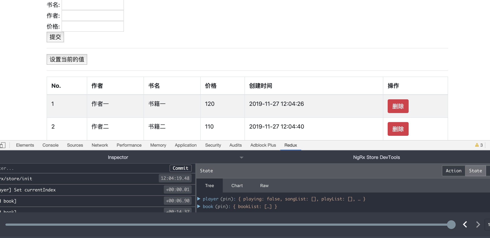

### 一、案例运行后的效果图



### 二、关于`ngrx`的认识

- 1、[官网地址](https://ngrx.io/)
- 2、`ngrx`是借鉴`redux`的思维,专门为`angular`中定制的一个状态管理的包,类似`react`中的`redux`、`vue`中的`vuex`,主要包括以下几个模块(本文先介绍`@ngrx/store`)
  - `@ngrx/store`
  - `@ngrx/store-devtools`
  - `@ngrx/effects`
  - `@ngrx/router-store`
  - `@ngrx/entity`
  - `@ngrx/data`
  - `@ngrx/schematics`
- 3、需要使用`ngrx`的场景
  - 在`angular`项目开发中属于非必须的
  - 大项目中需要进行组件通讯,数据共享

### 三、构建项目

- 1、使用`@angular/cli`初始化项目

  ```shell
  ng new angular-ngrx
  ```

- 2、创建一个数据的`module`(手动修改名字为`AppStoreModule`,不然会和`@ngrx/store`中的重名)

  ```shell
  ng g m store
  ```

- 3、在`store`文件夹下创建三个文件夹

  - `actions`
  - `reducers`
  - `selectors`(非必须的,仅仅是对于一个状态树是对象的时候,写一个方法选择状态树中的一个节点)

- 4、手动安装`@ngrx/store`

  ```shell
  npm install @ngrx/store --save
  ```

- 5、手动安装`@ngrx/store-devtools`

  ```shell
  npm install @ngrx/store-devtools --save
  ```

- 6、在`reducers`文件夹下创建`index.ts`(使用`ng add @ngrx/store`会默认生成的)

  ```ts
  import { ActionReducerMap, MetaReducer } from "@ngrx/store";
  import { environment } from "../../../environments/environment";

  // 项目中全部的状态
  export interface State {}

  // 全部的reducer函数
  export const reducers: ActionReducerMap<State> = {};

  export const metaReducers: MetaReducer<State>[] = !environment.production
    ? []
    : [];
  ```

- 7、浏览器要安装`redux`插件
- 8、在`store.module.ts`中配置浏览器调试的[更多配置见](https://ngrx.io/guide/store-devtools)

  ```ts
  @NgModule({
    declarations: [],
    imports: [
      StoreModule.forRoot(reducers, {
        metaReducers,
        runtimeChecks: {
          strictStateImmutability: true,
          strictActionImmutability: true,
          strictStateSerializability: true,
          strictActionSerializability: true,
        },
      }),
      StoreDevtoolsModule.instrument({
        maxAge: 20,
        logOnly: environment.production,
      }),
    ],
  })
  export class AppStoreModule {}
  ```

### 四、在项目中使用`@ngrx/store`

- 1、代码的使用见[github](https://github.com/kuangshp/angular-ngrx)中的`book`组件

- 2、有关于`angular`的问题可以加我微信,并注明来源
  <div>
    
  </div>
